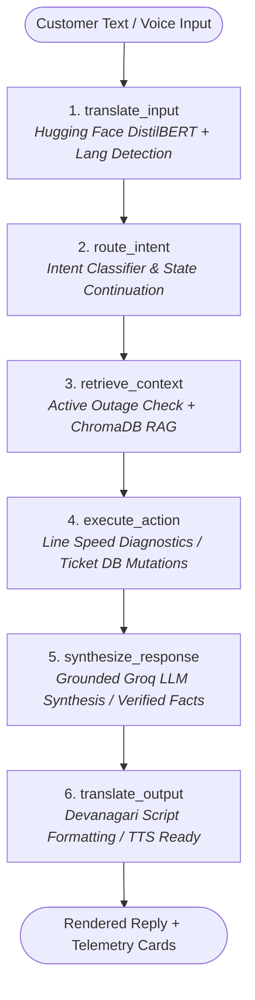
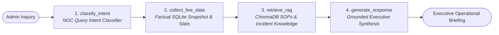

# TelConnect — Telecom Complaint Intelligence & Automated Resolution Assistant

> **Enterprise-Grade AI Platform for Telecom Network Intelligence, Proactive Outage Detection & Closed-Loop Autonomous Customer Resolution**  
> *Built to PRD v7.0 (Cognizant Hackathon — Use Case 13)*

---

## Executive Summary

**TelConnect** is an AI-native telecom operations and customer resolution platform that bridges customer-facing support and network operations into a unified, real-time closed loop. Built on a **100% free-tier, zero-cost stack**, it pairs an **Admin Operations Console** with an **Autonomous Customer AI Assistant** sharing a single source of truth (`tci.db`).

- **See Outages Before the 200th Complaint**: An automated statistical anomaly engine monitors complaint density across regions in real time, detecting surges against rolling historical baselines and generating evidence-backed root-cause dossiers.
- **Multilingual Autonomous Agent**: Powered by a 6-node **LangGraph StateGraph** and **Hugging Face Multilingual DistilBERT**, the assistant communicates natively in English, Hindi (Devanagari), and colloquial Hinglish transliteration with **Groq Whisper** voice input and **Web Speech** audio readout.
- **Real-Time Line Diagnostics**: Customers can run instantaneous on-demand telemetry tests (download/upload speed, ping latency, jitter, packet loss) directly in the chat stream.
- **Dense Vector RAG Knowledge Base**: Uses **Sentence Transformers (`all-MiniLM-L6-v2`)** and **ChromaDB** to retrieve approved standard operating procedures (SOPs), troubleshooting guides, and historical resolutions.
- **Operations AI Assistant**: A dedicated LangGraph Operations Agent equips Network Operations Center (NOC) admins with instant decision support, SLA breach tracking, escalation risk breakdowns, and SOP recommendations.
- **Explainable Multi-Factor Scoring**: Transparent priority calculation ($P1 - P4$) with contributing factor chips and SLA deadlines rather than opaque black-box numbers.
- **100% Offline Resilience**: Complete feature parity and deterministic fallback engines across all ML, NLP, RAG, and translation modules when operating with no API keys or internet connection.

---

## System Architecture

```mermaid
flowchart TB
    subgraph Client_Layer["1. Presentation & UI Layer (React 18/19 + Vite + Leaflet)"]
        Landing["Landing Page (Radar Hero + Live Metrics)"]
        Theme["Theme Engine (Dark / Light Mode)"]
        CustChat["Customer AI Portal (40/60 Split, STT Voice / TTS Audio, Line Diag Cards)"]
        AdminCockpit["Admin Operations Console (Queue, Heatmap, Dossiers, Notify Queue, Audit)"]
        AdminAgentUI["Admin AI Assistant (NOC Decision Support, Prompt Chips, RAG SOPs)"]
    end

    subgraph API_Layer["2. API & Security Layer (Python FastAPI + Uvicorn)"]
        AuthModule["JWT & Scrypt Token Authentication (Role-Gated)"]
        UploadModule["Universal CSV Ingestion & Auto-Schema Mapper"]
        DiagRouter["Dynamic Line Diagnostics (/api/chat/diagnostic)"]
        ChatRouter["Customer & Admin Assistant Routers (/api/chat, /api/admin/assistant)"]
        AdminRouter["Queue, Incidents, Alerts & Notification Endpoints"]
        GeoRouter["Geoapify Geocoding Engine (Caching & Coords Validation)"]
    end

    subgraph Intelligence_Layer["3. Intelligence & Agentic Layer"]
        CustGraph["Customer LangGraph Multi-Task Agent (6-Node StateGraph)"]
        AdminGraph["Admin LangGraph Operations Agent (4-Node StateGraph)"]
        HFTranslator["Hugging Face DistilBERT Tokenizer + Groq Translation"]
        ChromaRAG["ChromaDB Vector Store + Sentence Transformers (all-MiniLM-L6-v2)"]
        MLPipeline["scikit-learn Classifier (Macro-F1 >= 0.80) & Priority Scoring"]
        SpikeEngine["Rolling-Baseline Anomaly Detector & Root-Cause Investigator"]
        NotifyEngine["Proactive Affected-Customer Matcher & Notification Drafter"]
    end

    subgraph Storage_Layer["4. Storage & State Layer"]
        SQLiteDB[("SQLite Database (tci.db - WAL Mode)\nSingle Source of Truth")]
        ChromaStore[("ChromaDB Persistent Vector Store\n(backend/data/chroma_db)")]
        GroqCloud["Groq Cloud API (Free Tier Llama-3 & Whisper)\n[Deterministic Offline Fallbacks]"]
    end

    Client_Layer --> API_Layer
    API_Layer --> Intelligence_Layer
    Intelligence_Layer <--> Storage_Layer
```



---

## Key Capabilities & Features

### 1. Admin Operations Console (9 Navigation Hubs / 16 Subsystems)

| Hub / Feature | Route | Key Capabilities |
| :--- | :--- | :--- |
| **📊 Operations Overview** | `/admin` | Real-time KPI stat cards, complaint volume time series, category donut breakdown, daily sentiment trends, recurring issue theme tags, and explainable priority-ranked escalation risk table. |
| **🤖 Admin AI Assistant** | `/admin/assistant` | LangGraph-powered NOC decision support agent. Answers queries on immediate priority tickets, escalation risk factors, regional complaint volume surges, SLA deadlines, category classification reasoning, incident status briefings, and ChromaDB SOP recommendations. |
| **📤 Universal Dataset Upload** | `/admin/upload` | 3-step CSV ingestion wizard with auto-schema detection, PII redaction (names, phones, emails), ETL cleaning, ML scoring, spike detection, root-cause analysis, and notification drafting. |
| **📋 Complaint Queue & Triage** | `/admin/queue` | Priority-ranked ($P1 - P4$) triage workbench with multi-facet filters (category, region, service, status, channel), auto-generated ticket summaries, and slide-over ticket drawer for team assignment, status updates, SLA countdowns, and resolution proposals. |
| **🗺️ Leaflet Network Heatmap** | `/admin/heatmap` | Interactive map of India rendering regional complaint density circles (Red = Spike, Amber = Elevated, Teal = Normal), region statistics, and active spike banner linking directly to incident dossiers. |
| **🔍 Incidents & Root Cause** | `/admin/incidents` | Evidence dossiers displaying likely root causes, confidence bars, and $\ge 3$ computed evidence bullets (cluster concentration, dominant symptoms, spike vs baseline, onset window, matching past incidents). Actions: *Acknowledge*, *Assign to Field Team*, *Draft Notifications*, *Mark Resolved*. |
| **🚨 Real-Time Alert Inbox** | `/admin/alerts` | Instant spike alerts with unread counter badges, direct links to incident dossiers, and mark-as-read functionality. |
| **✉️ Proactive Notify Queue** | `/admin/notifications` | Human-in-the-loop review queue for drafting, approving, or rejecting broadcast notifications to affected users before they file repeated complaints. |
| **🔒 Tamper-Evident Audit Log** | `/admin/audit` | Immutable security audit trail capturing every privileged action, actor, timestamp, and payload. |

---

### 2. Autonomous Customer AI Assistant (`/chat`)

- **40/60 Modern Split Layout**: Conversational stream on the right paired with contextual user profile, quick action pills (*Speed Test*, *Internet Down*, *My Ticket*, *Billing*), and personal ticket tracker drawer on the left.
- **Multilingual Intelligence**: Native support for **English**, **Hindi (हिन्दी Devanagari)**, and **Hinglish** transliteration, tokenized via **Hugging Face Multilingual DistilBERT** with Groq zero-shot neural translation and domain lexical fallbacks.
- **Multimodal Voice Input & Output**:
  - **Groq Whisper STT**: Fast multilingual voice transcription supporting English and Hindi voice inputs.
  - **Web Speech API TTS**: Audio readouts with natural bilingual voice synthesis.
- **Dynamic Network & Line Diagnostics**: On-demand telemetry tests (download speed, upload speed, ping latency, jitter, packet loss, line health status) rendered as interactive cards in the chat stream.
- **Intelligent Complaint Interception**:
  - *Live Incident Awareness*: Proactively flags active outages in the user's area, explains root cause & ETA in plain words, and links reports without filing duplicate tickets.
  - *ChromaDB RAG SOP Resolution*: Retrieves approved troubleshooting guides to resolve issues before ticketing.
  - *Pre-Ticket Verification*: Summarizes extracted details (issue, category, region, service) and requests user confirmation before ticket creation.
  - *Automated Ticket Registration*: Assigns $P1 - P4$ priority, computes SLA deadline, generates plain-language ticket summary, and instantly routes to the admin queue.
  - *Live Status Tracking*: Instant status lookups with assigned team details, SLA countdown, and resolution notes.
  - *Confirm-to-Close Loop*: Technical fixes transition tickets to `resolved_pending_confirmation`; tickets close *only* when the customer confirms (`Yes ✓`), followed by a 1–5 star CSAT rating. Rejection (`No ✗`) automatically reopens and escalates the ticket.
- **In-App Notification Feed**: Live transactional notifications (ticket created, assigned, fix proposed, status changed) accessible via the top-bar bell icon.

---

### 3. Theme Engine

- Built-in **Dark Mode** and **Light Mode** toggle accessible across the Landing Page, Admin Console, and Customer Assistant.

---

## Agentic & AI Architecture

### 1. Customer LangGraph Agent (6-Node Multi-Task Workflow)



1. **`translate_input`**: Detects input language (`en` or `hi`), tokenizes via Hugging Face DistilBERT (`distilbert-base-multilingual-cased`), and normalizes Hinglish/Hindi idioms into canonical English semantics.
2. **`route_intent`**: Evaluates conversational continuations (`awaiting_registration_confirm`, `awaiting_fix_feedback`, `awaiting_feedback_rating`) across 15+ intent categories (`DIAGNOSTIC`, `REPORT_COMPLAINT`, `CHECK_STATUS`, `ESCALATE`, `REOPEN_COMPLAINT`, `BILLING_QUERY`, `KNOWN_INCIDENT`, etc.).
3. **`retrieve_context`**: Checks the SQLite database for active regional incidents and executes dense cosine vector retrieval against ChromaDB KB documents.
4. **`execute_action`**: Executes deterministic backend operations: line diagnostics (`run_network_diagnostic`), ticket registration, status transitions, and compiles strict verified facts.
5. **`synthesize_response`**: Synthesizes empathetic, grounded replies via Groq Llama-3, strictly bound to verified facts with zero hallucination.
6. **`translate_output`**: Formats final responses in natural Devanagari script for Hindi users, preserving technical IDs (`TCK-xxx`, `INC-xxx`) and metrics.

---

### 2. Admin Operations LangGraph Agent (4-Node Decision Support Workflow)



- Grounded strictly in live database metrics, active incident dossiers, and ChromaDB SOPs.
- Formats structured briefings with key statistics, immediate ticket rankings, and category reasoning.

---

### 3. ChromaDB Vector RAG Architecture

- **Embedding Model**: `SentenceTransformer` (`all-MiniLM-L6-v2`, configurable via `EMBEDDING_MODEL`).
- **Vector Database**: `ChromaDB` persistent client (`backend/data/chroma_db`) with native cosine distance space (`hnsw:space: cosine`).
- **Indexed Knowledge**: Standard operating procedures (SOPs), troubleshooting FAQs, past incident post-mortems, and closed resolved complaints.
- **Retrieval Pipeline**: Queries are normalized and embedded, matched against ChromaDB collections, filtered by document kind, and converted to normalized similarity scores ($0.0 - 1.0$).

---

### 4. Explainable Multi-Factor Priority & SLA Scoring

Priority scores ($0 - 100$) determine triage ranking ($P1 - P4$) using a multi-factor formula:

$$\text{PriorityScore} = \text{clamp}\Big(0, 100, \, w_1 \cdot U + w_2 \cdot S + w_3 \cdot E + w_4 \cdot I + w_5 \cdot R \Big)$$

- $U \in [0, 1]$: Urgency score (detected from emergency keywords like *down, exam, hospital, critical*).
- $S \in [0, 1]$: Inverted sentiment score (higher for strongly negative sentiment).
- $E \in [0, 1]$: Churn / escalation risk probability (e.g., mentions of *TRAI, legal, switch operator*).
- $I \in \{0, 1\}$: Active regional incident indicator ($+20\text{ bonus points}$ if linked to an ongoing outage).
- $R \in [0, 1]$: Repeat contact count for the customer account.

| Priority Band | Score Range | SLA Deadline | Automated Operational Action |
| :---: | :---: | :---: | :--- |
| **P1 — Critical** | $80 - 100$ | **2 Hours** | High-priority admin alert; immediate queue banner |
| **P2 — High** | $60 - 79$ | **6 Hours** | Routed to Tier-2 specialist queue |
| **P3 — Medium** | $35 - 59$ | **24 Hours** | Standard operational queue |
| **P4 — Low** | $0 - 34$ | **48 Hours** | General queue |

---

## Tech Stack & Dependencies

```
TelConnect Platform
├── Frontend: React 19 / 18, Vite, React Router v7, Leaflet, React-Leaflet, Recharts
├── Backend: Python 3.10+, FastAPI, Uvicorn, Pydantic, Scikit-Learn, Joblib, NumPy
├── Agents & Workflow: LangGraph StateGraph (Multi-Task State Machines)
├── Vector DB & Embeddings: ChromaDB PersistentClient, Sentence-Transformers (all-MiniLM-L6-v2)
├── Multilingual NLP: Hugging Face Transformers (distilbert-base-multilingual-cased)
├── AI & Speech: Groq Cloud API (Llama-3.3-70b-versatile, Llama-3.1-8b-instant, Whisper-large-v3-turbo)
├── Geocoding: Geoapify Geocoding REST API (with dynamic memory cache & boundary validation)
├── Database: SQLite 3 with WAL Mode (tci.db)
└── Testing: Pytest, HTTPX, FastAPI TestClient (106+ passing tests)
```

---

## Setup & Installation Guide (From Zero)

### System Prerequisites
- **Python 3.10+** (`python --version` or `python3 --version`)
- **Node.js 18+** (`node --version`)

---

### Step 1: Clone and Set Up Backend

#### On Linux / macOS:
```bash
# 1. Navigate to backend directory
cd backend

# 2. Create and activate Python virtual environment
python3 -m venv .venv
source .venv/bin/activate

# 3. Install dependencies
pip install -r requirements.txt

cd ..
```

#### On Windows (PowerShell / Command Prompt):
```powershell
# 1. Navigate to backend directory
cd backend

# 2. Create and activate Python virtual environment
python -m venv .venv
.venv\Scripts\activate

# 3. Install dependencies
pip install -r requirements.txt

cd ..
```

---

### Step 2: Set Up Frontend

```bash
# Navigate to frontend directory and install npm packages
cd frontend
npm install
cd ..
```

---

### Step 3: Configure Environment Variables (Optional but Recommended)

Create a `.env` file in the `backend/` directory:

```bash
# backend/.env
GROQ_API_KEY=gsk_your_free_groq_api_key_here
GEOAPIFY_API_KEY=your_free_geoapify_api_key_here

# Optional RAG & ChromaDB Configuration Overrides
EMBEDDING_MODEL=all-MiniLM-L6-v2
CHROMA_DB_PATH=backend/data/chroma_db
CHROMA_COLLECTION_NAME=telecom_rag_kb
TOP_K=3

# Optional Scheduler Interval (seconds)
TCI_SCHEDULER_INTERVAL=60
```

> **Note on Free-Tier API Keys**:
> - Get a free Groq API key at [https://console.groq.com](https://console.groq.com).
> - Get a free Geoapify API key at [https://www.geoapify.com](https://www.geoapify.com).
> - **100% Offline Capability**: If no API keys are configured, TelConnect automatically runs in offline mode using built-in deterministic fallbacks for text generation, speech handling, translation, and geocoding.

---

### Step 4: Run the Application

#### Option A: Unified Launcher (Linux / macOS)
```bash
chmod +x run.sh
./run.sh
```

#### Option B: Run Services in Separate Terminals

**Terminal 1 — Backend:**
```bash
# Linux / macOS
cd backend && .venv/bin/python -m uvicorn app.routes.main:app --host 0.0.0.0 --port 8000

# Windows
cd backend
.venv\Scripts\python.exe -m uvicorn app.routes.main:app --host 0.0.0.0 --port 8000
```

**Terminal 2 — Frontend:**
```bash
cd frontend
npm run dev
```

- **Frontend (Web Application)**: [http://localhost:5173](http://localhost:5173)  *(Open this in your browser)*
- **Backend (API & Interactive Docs)**: [http://localhost:8000/docs](http://localhost:8000/docs)

> **Important**: Do **not** pass `--reload` to uvicorn in production/demo mode to prevent duplicate background scheduler threads.

---

## Seeded Demo Accounts & Scenarios

The platform automatically seeds demo accounts and database snapshots on first start:

| Role | Email | Password | Assigned Region / Service | Scenario / Purpose |
| :--- | :--- | :--- | :--- | :--- |
| **Admin** | `admin@telecom.com` | `admin123` | *All Regions* | Full Operations Console, Heatmap, Queue, Dossiers, AI Assistant |
| **Customer** | `rohan@example.com` | `customer123` | Raj Nagar, Ghaziabad (Broadband) | **Outage Region**: Matches live incident `INC-2025-0873` |
| **Customer** | `arjun@example.com` | `customer123` | Raj Nagar, Ghaziabad (Broadband) | Outage Region: Tests incident-aware interception |
| **Customer** | `tanvi@example.com` | `customer123` | Raj Nagar, Ghaziabad (Broadband) | Outage Region: Verifies duplicate ticket prevention |
| **Customer** | `karan@example.com` | `customer123` | Gurgaon Sector 29 (Mobile Data) | **Congestion Region**: Distinct mobile speed congestion incident |
| **Customer** | `sneha@example.com` | `customer123` | Gurgaon Sector 29 (Mobile Data) | Congestion Region: Tests mobile telemetry diagnostics |
| **Customer** | `priya@example.com` | `customer123` | Andheri, Mumbai (Mobile Data) | **Clean Region**: Known-fix RAG SOP resolution demo |
| **Customer** | `nikhil@example.com` | `customer123` | Koramangala, Bangalore (Broadband) | Clean Region: Fresh ticket registration & verify lifecycle |

*Customers can also self-register from the login page. Admin accounts are provisioned by policy.*

---

## Resetting Demo Data

To reset the database and reseed fresh demo accounts, knowledge base documents, and dynamic CSV data:

```bash
# Linux / macOS
chmod +x demo-reset.sh
./demo-reset.sh
./run.sh

# Windows (PowerShell)
Remove-Item -Force backend\data\tci.db*, backend\data\sample_complaints.csv -ErrorAction SilentlyContinue
```

---

## The 2-Minute Demo Script (Evaluator Walkthrough)

1. **Admin Login & Dataset Upload**:
   - Log in as `admin@telecom.com` (`admin123`).
   - Go to **Dataset upload** (`/admin/upload`), download the sample CSV, upload it, and confirm the auto-detected column mappings.
   - Watch the ETL, PII redaction, ML scoring, spike detector, and root-cause investigator activate live.
2. **Operations Cockpit (`/admin`)**:
   - Inspect the real-time KPI cards, volume time series showing the injected Raj Nagar outage spike, category breakdown, sentiment trend, and priority risk table.
3. **Network Heatmap (`/admin/heatmap`)**:
   - Observe Raj Nagar glowing red (surge density) while other circles reflect normal/elevated traffic.
   - Click the "Spike Detected" banner to jump directly to the root-cause dossier.
4. **Root-Cause Dossiers (`/admin/incidents`)**:
   - Review the auto-generated dossier: likely root cause (e.g., *Fiber Cut / Feeder Disruption*), confidence gauge ($92\%$), and 5 checkable evidence bullets.
   - Click **Acknowledge** → **Assign to Field Team** → **Draft Notifications**.
5. **Proactive Notify Queue (`/admin/notifications`)**:
   - Review the drafted broadcast notifications matched to Raj Nagar broadband subscribers.
   - Click **Approve & Send** to deliver them to customer inboxes.
6. **🤖 Admin AI Assistant (`/admin/assistant`)**:
   - Ask: *"Which complaints need immediate attention?"*, *"What is the likely root cause?"*, or *"Why are complaints increasing in Raj Nagar?"*.
   - View structured operational briefings synthesized from live database metrics and ChromaDB SOPs.
7. **Customer Closed-Loop Experience (`/chat`)**:
   - Sign in as `rohan@example.com` (`customer123`).
   - Notice the **proactive service banner** at the top before even typing.
   - Click the **⚡ Speed Test** action pill to run a real-time line diagnostic showing degraded speeds ($4.2\text{ Mbps}$, high latency) linked to the active incident.
   - Type in Hinglish: *"net nahi chal raha subah se"*.
   - The assistant intercepts the message, explains the known outage in plain words, and links the report without creating a duplicate ticket.
   - Switch accounts or test a clean region (`priya@example.com`) to experience RAG troubleshooting, ticket verification, and the **confirm-to-close loop**.

---

## Running the Automated Test Suite

The test suite covers authentication boundaries, universal CSV ingestion, PII redaction, scikit-learn classifier F1 scores, Geoapify geocoding, Hugging Face DistilBERT translation, ChromaDB vector indexing/retrieval, dynamic line diagnostics, and LangGraph multi-task workflows:

```bash
# Run full test suite from project root
backend/.venv/bin/python -m pytest backend/tests/ -v     # Linux / macOS
backend\.venv\Scripts\python.exe -m pytest backend/tests/ -v # Windows
```

```
========================= 106 passed in backend/tests/ =========================
- test_admin_assistant.py: Admin LangGraph agent, intent classification, live DB snapshot, ChromaDB RAG
- test_e2e.py: End-to-end auth, upload wizard, ETL, ML scoring, lifecycle transitions, confirm-to-close
- test_geo.py: Geoapify geocoding, boundary validation, coordinate caching
- test_ml_modular.py: Category classifier F1 gate, sentiment/urgency scoring, priority multi-factor formula
- test_multilingual_agent.py: DistilBERT tokenization, English/Hindi translation, Devanagari script enforcement
- test_rag_chroma.py: SentenceTransformer embeddings, ChromaDB vector indexing and cosine retrieval
```

---

## Project Directory Layout

```
telconnect/
├── backend/
│   ├── app/
│   │   ├── agents/
│   │   │   ├── admin_agent.py          # LangGraph Admin Operations Agent
│   │   │   └── agent_graph.py          # LangGraph Customer Multi-Task Agent (6 nodes)
│   │   ├── controllers/
│   │   │   ├── admin_assistant.py      # Admin AI Assistant controller & snapshot builder
│   │   │   ├── analytics.py            # Aggregations, heatmap density, risk table
│   │   │   ├── assistant.py            # Customer conversational controller
│   │   │   └── auth.py                 # JWT authentication & role gating
│   │   ├── ml/
│   │   │   ├── category_model.py       # TF-IDF + Logistic Regression category classifier
│   │   │   ├── escalation.py           # Multi-factor escalation risk predictor
│   │   │   ├── ml_service.py           # Unified ML orchestration engine
│   │   │   ├── priority_model.py       # Multi-factor priority (P1-P4) & SLA calculator
│   │   │   ├── sentiment_model.py      # Sentiment & urgency scoring
│   │   │   └── train_category.py       # Model training pipeline with F1 validation
│   │   ├── routes/
│   │   │   └── main.py                 # FastAPI application, all routes, background scheduler
│   │   ├── services/
│   │   │   ├── etl.py                  # Universal CSV ingestion, PII redaction, normalizer
│   │   │   ├── geo.py                  # Geoapify Geocoding engine & memory cache
│   │   │   ├── groq_client.py          # Groq LLM (Llama-3) & Whisper STT client
│   │   │   ├── incidents.py            # Spike detector & root-cause investigator
│   │   │   ├── notify.py               # Customer matching & notification approval engine
│   │   │   ├── rag.py                  # ChromaDB vector retrieval & SentenceTransformers
│   │   │   └── translator.py           # Hugging Face DistilBERT multilingual tokenizer
│   │   ├── db.py                       # SQLite connection manager, schema, audit logging
│   │   └── seed.py                     # Demo accounts, initial KB docs, seed complaints
│   ├── data/
│   │   ├── chroma_db/                  # Persistent ChromaDB vector database
│   │   ├── sample_complaints.csv       # Demo complaints dataset
│   │   └── tci.db                      # Operational SQLite database
│   ├── tests/                          # Automated Pytest test suites (106+ tests)
│   └── requirements.txt                # Python backend dependencies
├── frontend/
│   ├── src/
│   │   ├── pages/
│   │   │   ├── AdminAssistant.jsx      # Admin AI Assistant operations cockpit
│   │   │   ├── AdminLayout.jsx         # Admin sidebar, navigation, live status bar
│   │   │   ├── Alerts.jsx              # Real-time spike alert inbox
│   │   │   ├── Audit.jsx               # Immutable administrative audit log
│   │   │   ├── Chat.jsx                # Customer 40/60 chat, diagnostics & voice UI
│   │   │   ├── Heatmap.jsx             # Leaflet regional complaint heatmap
│   │   │   ├── Incidents.jsx           # Root-cause dossiers & field ops dispatch
│   │   │   ├── Landing.jsx             # Product landing page with animated radar hero
│   │   │   ├── Login.jsx               # Role-separated authentication portal
│   │   │   ├── NotifyQueue.jsx         # Proactive notification approval queue
│   │   │   ├── Overview.jsx            # KPI stat cards, charts, risk tables
│   │   │   ├── Queue.jsx               # Priority triage workbench & ticket drawer
│   │   │   └── UploadWizard.jsx        # 3-step CSV upload & schema mapping wizard
│   │   ├── App.jsx                     # Route definitions & authentication guards
│   │   ├── ThemeContext.jsx            # Dark / Light mode state provider
│   │   ├── ThemeToggle.jsx             # Floating theme toggle button
│   │   ├── api.js                      # Centralized API client & token storage
│   │   └── styles.css                  # Enterprise design system styles
│   └── package.json                    # React & frontend dependencies
├── docs/                               # Master PRD v7.0, technical specifications, and architecture plans
├── demo-reset.sh                       # Quick script to reset database and reseed
├── run.sh                              # Unified application startup script
└── README.md                           # Master documentation
```

---

## Design Principles & Security Safeguards

1. **Customer-First Closed Loop**: Tickets never close silently. A proposed technical resolution requires the customer's explicit verification in the chat before closure and CSAT rating.
2. **Deterministic Control Plane**: LLMs synthesize language, empathy, and briefings. All privileged operations (ticket creation, status transitions, line testing, broadcast approvals) are executed strictly by authenticated backend APIs.
3. **Zero Data Drift**: Both the Admin Console and Customer Assistant query the exact same SQLite database (`tci.db`), eliminating stale cache hallucinations.
4. **Strict PII Protection**: Customer phone numbers, emails, and names are stripped or redacted upon ingestion before storage or any LLM inference.
5. **Explainable AI**: Priority scores and root-cause hypotheses expose their underlying mathematical weights and empirical evidence bullets rather than arbitrary scores.

---

## License & Credits

Built for the **Cognizant Hackathon (Use Case 13)** by the TelConnect Engineering Team.  
Designed to deliver enterprise-grade autonomous intelligence at zero infrastructure cost.
