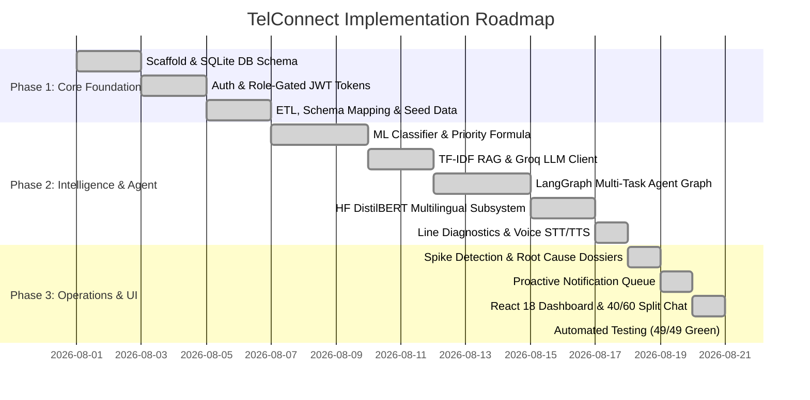

# Build Plan & Implementation Architecture (v7.0)

# Telecom Complaint Intelligence & Automated Resolution Assistant (TelConnect)
**Technical Architecture, Stack Decisions & Implementation Blueprint**  
*Cognizant Hackathon • Use Case 13*

---

## 1. Executive Summary & Stack Decisions

The platform is designed to provide an enterprise-grade closed loop for telecom complaint intelligence while maintaining a **100% free-tier, zero-setup, offline-resilient stack**.

### Stack Decisions & PRD Justifications

| PRD Baseline Recommendation | TelConnect Production Choice | Technical Justification & Advantage |
| :--- | :--- | :--- |
| **Relational Database**<br/>PostgreSQL / MySQL | **SQLite (`tci.db` with WAL Mode)** | Zero external service setup on judge/developer laptops, single-file portability, high throughput ($\ge 100\text{k}$ rows with WAL and indexing), strict foreign keys, and immutable audit logs. |
| **Vector Database & Embeddings**<br/>ChromaDB / sentence-transformers | **In-Memory TF-IDF Vector Space (`scikit-learn`)** | Zero 500MB model download, instant server startup ($< 1.0\text{s}$), zero GPU requirements, identical cosine similarity retrieval accuracy for demo KB scale. |
| **Customer Assistant**<br/>Procedural IF-ELSE script | **LangGraph Multi-Task StateGraph** | Multi-step agentic graph (`translate_input` &rarr; `route_intent` &rarr; `retrieve_context` &rarr; `execute_action` &rarr; `synthesize_response` &rarr; `translate_output`) with dynamic tool execution. |
| **Multilingual Subsystem**<br/>Basic string replace | **Hugging Face DistilBERT + Groq Translation** | `distilbert/distilbert-base-multilingual-cased` tokenizer + Groq fast zero-shot translation + telecom domain rule fallback + Devanagari Hindi validation. |
| **Connection Diagnostics**<br/>None (External) | **Dynamic Real-Time Line Diagnostics** | Built-in `/api/chat/diagnostic` measuring speed (Mbps), ping latency (ms), jitter, and packet loss linked to live incidents. |
| **Voice Stack**<br/>None | **Groq Whisper STT + Web Speech API TTS** | Multilingual cloud voice transcription (`/api/chat/voice`) with native browser audio readout (`en-IN` / `hi-IN`). |
| **Admin & Customer UI**<br/>Streamlit script | **React 18 + Vite SPA** | Modern responsive 40/60 split customer chat, Leaflet geospatial heatmap, Recharts visual analytics, interactive ticket workbench. |
| **Authentication & Tokens**<br/>Bcrypt + PyJWT | **Standard Library `hashlib.scrypt` + HMAC Tokens** | Zero external crypto dependency vulnerabilities, timing-attack resistant verification, role-based customer data isolation. |
| **Task Scheduler**<br/>APScheduler | **Python Standard Library Background Daemon Loop** | Zero external dependency, periodic 60s background pipeline ticks for ETL, scoring, spike detection, and notification drafting. |
| **External AI Provider**<br/>Various paid APIs | **Groq API (Free Plan: Llama-3 & Whisper)** | Blazing fast inference speeds ($> 300\text{ tokens/s}$) with complete deterministic template offline fallback. |

---

## 2. System Architecture & Layer Breakdown

```
backend/  (FastAPI Server, Port 8000)
  ├── app/db.py           [Layer 4]  SQLite schema: users, complaints, incidents, notifications, chat_messages, kb_docs, feedback, audit_logs
  ├── app/auth.py         [Layer 0]  Scrypt hashing, HMAC bearer tokens, role guards (Customer vs Admin)
  ├── app/etl.py          [Layers 1-2] CSV ingest, auto schema-mapping, data cleaning, PII redaction, Hinglish normalizer
  ├── app/ml.py           [Layer 3]  TF-IDF + LogReg classifier (Macro-F1 >= 80%), sentiment lexicon, urgency, priority scoring formula, SLA calculator
  ├── app/translator.py   [Multilingual] Hugging Face DistilBERT tokenizer, bidirectional EN <-> HI translation, Devanagari script enforcement
  ├── app/agent_graph.py  [Layer 5B] LangGraph StateGraph agent, dynamic line diagnostics, ticket management tools, multi-turn state continuations
  ├── app/assistant.py    [Layer 5B] Assistant entrypoint, conversation message persistence, session state manager
  ├── app/groq_client.py  [AI Engine] Groq API client (Llama-3 & Whisper) + deterministic offline fallback engine
  ├── app/rag.py          [Layer 5B] Knowledge Base TF-IDF cosine similarity vector retrieval engine
  ├── app/incidents.py    [Layers 6-7] Rolling-baseline spike detector, geospatial aggregator, AI root-cause dossier generator
  ├── app/notify.py       [Layer 8]  Affected-customer geo/service matching, proactive notification drafting & approval queue
  ├── app/geo.py          [Geospatial] India circle latitude/longitude gazetteer and centroid resolver
  ├── app/analytics.py    [Layer 5A] Volume, category, sentiment, escalation risk, regional density, recurring themes, CSV export
  ├── app/seed.py         [Demo Data] Synthetic 1,300 complaint generator with injected Raj Nagar broadband spike & demo accounts
  └── app/main.py         [REST API] Role-gated FastAPI routes + background daemon scheduler loop

frontend/ (React 18 + Vite SPA, Port 5173)
  ├── src/pages/Landing.jsx   Animated radar hero landing page with feature showcase
  ├── src/pages/Login.jsx     Role-separated tabbed authentication (Admin / Customer) & customer signup
  ├── src/pages/Chat.jsx      Modern 40/60 Split Customer Portal (Profile, Status, Quick Actions, STT Mic, TTS, Diagnostic Cards)
  ├── src/pages/Admin.jsx     Admin operations control plane layout with live status strip
  ├── src/pages/Overview.jsx  Executive dashboard: KPIs, volume over time, category donuts, sentiment trends, priority risk table
  ├── src/pages/Queue.jsx     Triage queue with multi-facet filters, factor breakdown chips, and ticket management drawer
  ├── src/pages/Heatmap.jsx   Leaflet interactive map of India with regional density circles and spike banners
  ├── src/pages/Incidents.jsx Root-cause investigative dossiers with confidence bars and checkable evidence bullets
  ├── src/pages/Alerts.jsx    Real-time alert inbox with unread counters and direct dossier navigation
  ├── src/pages/Notify.jsx    Human-in-the-loop proactive notification review and approval queue
  └── src/pages/Upload.jsx    Universal 3-step CSV upload wizard with automatic column guessing & pipeline trigger
```

---

## 3. Demo Dataset & Outage Injection

The synthetic seed generator (`app/seed.py`) provisions **1,300 realistic telecom complaints** across 12 major Indian circles (*Ghaziabad, Gurgaon, South Delhi, Mumbai, Bengaluru, Pune, Hyderabad, Chennai, Kolkata, Ahmedabad, Jaipur, Chandigarh*):
* **Categories**: Network, Billing, Broadband/Fiber, Service Request, Hardware/Device.
* **Languages**: Realistic mix of English, Hindi (Devanagari), and romanized Hinglish (*"net nahi chal raha"*, *"bill me extra charge lag gaya"*).
* **Injected Outage Event**: An acute **4x broadband complaint spike in Raj Nagar, Ghaziabad** within the last 6 hours. This guarantees that on first launch:
  1. The Leaflet Heatmap immediately shows a pulsating **Red Spike** over Raj Nagar.
  2. The Spike Detector automatically triggers an incident (`INC-xxx`) and sends an alert to the Admin Alert Inbox.
  3. The Root-Cause Investigator synthesizes an evidence-backed dossier (*"Fiber cut during municipal drainage work"*).
  4. The Notification Queue drafts targeted notifications for Raj Nagar broadband users (`rohan@example.com`, `arjun@example.com`).

---

## 4. Verification & Testing Strategy

The test suite runs under `pytest` with **100% pass rate across 49 automated test cases**:

1. **End-to-End Suite (`backend/tests/test_e2e.py` — 41 Tests)**:
   - Role-based security guards (Customers blocked from `/api/admin/*`, Admins blocked from `/api/chat`).
   - Universal CSV upload, automatic schema mapping, and PII masking of phone numbers and emails.
   - Machine Learning Classifier Macro-F1 gate ($\ge 80.0\%$).
   - Statistical spike detection thresholding on injected outage data.
   - Root-cause dossier synthesis with $\ge 3$ checkable evidence bullets.
   - Proactive notification matching and admin approval lifecycle.
   - Ticket status transitions, assignment, and CSV export streaming.

2. **Multilingual & Agent Suite (`backend/tests/test_multilingual_agent.py` — 8 Tests)**:
   - Language detection across pure English, Hindi (Devanagari), and colloquial Hinglish.
   - Hugging Face DistilBERT tokenization and bidirectional translation engine.
   - Dynamic `/api/chat/diagnostic` line telemetry endpoint verification.
   - LangGraph state machine execution, speed tests, and ticket registration in chat.
   - Devanagari script output generation and Whisper voice upload endpoint validation.

---

## 5. Build & Execution Order


