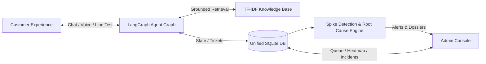
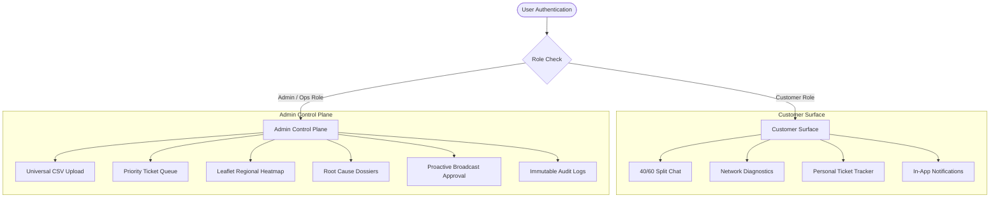
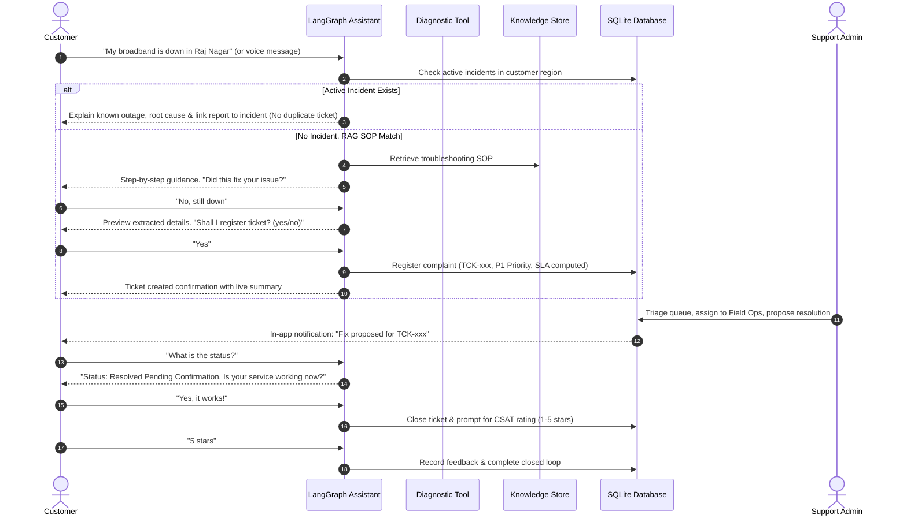
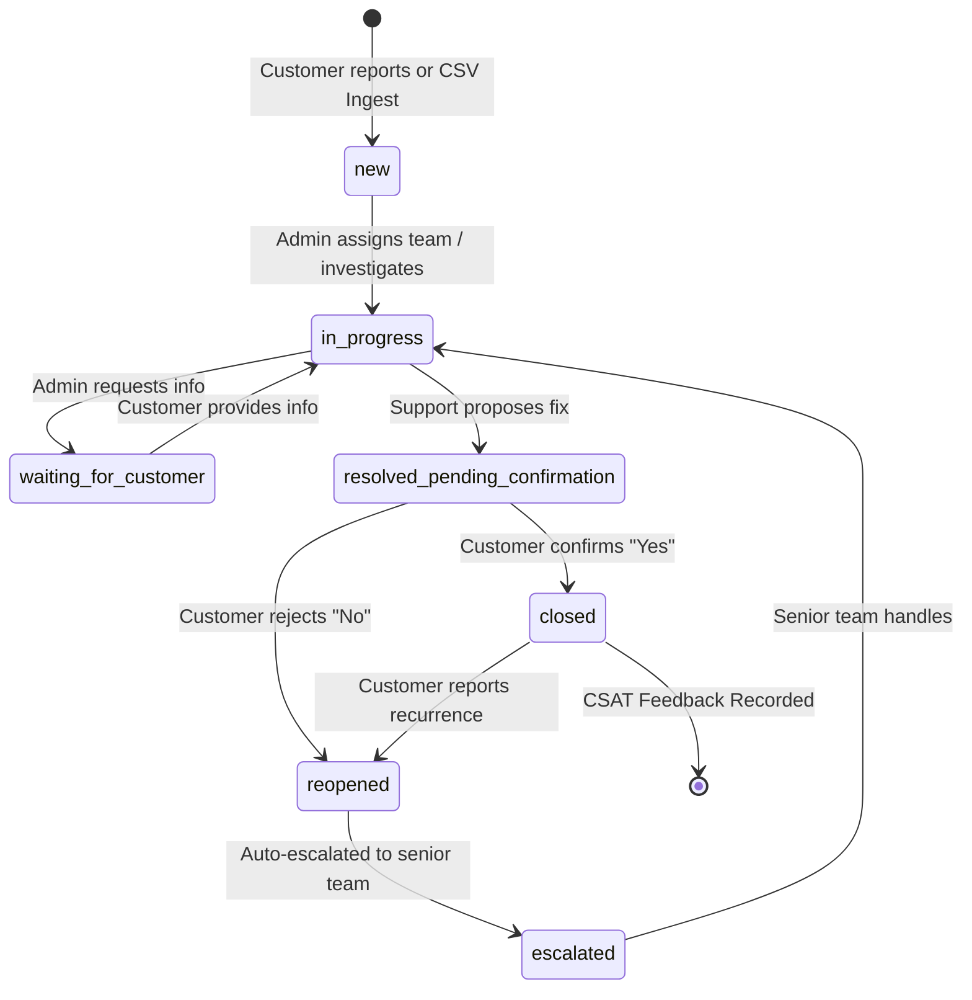
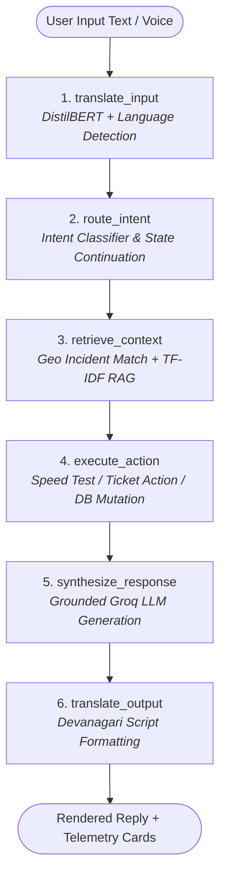
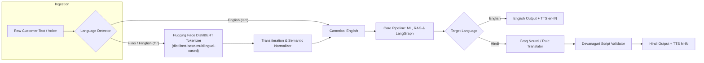
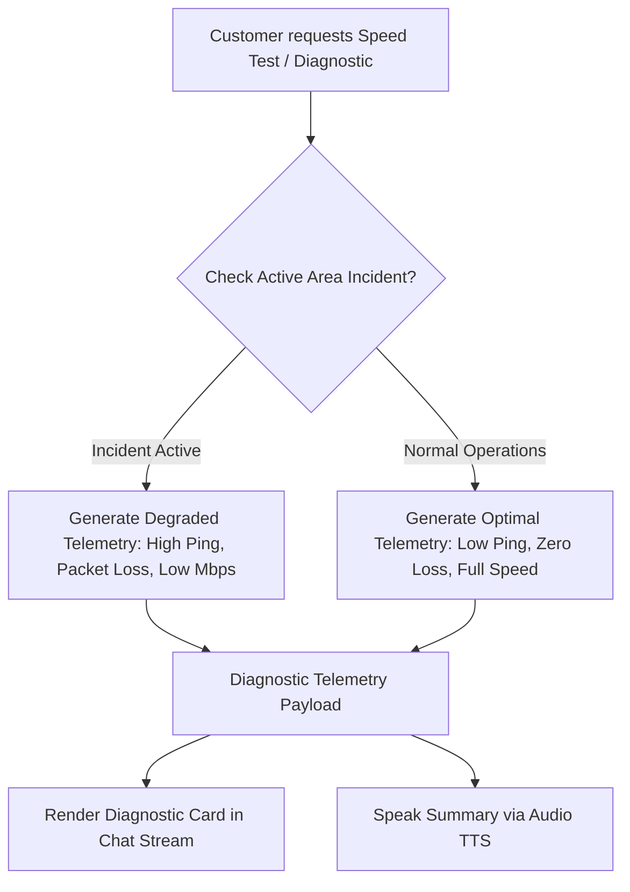
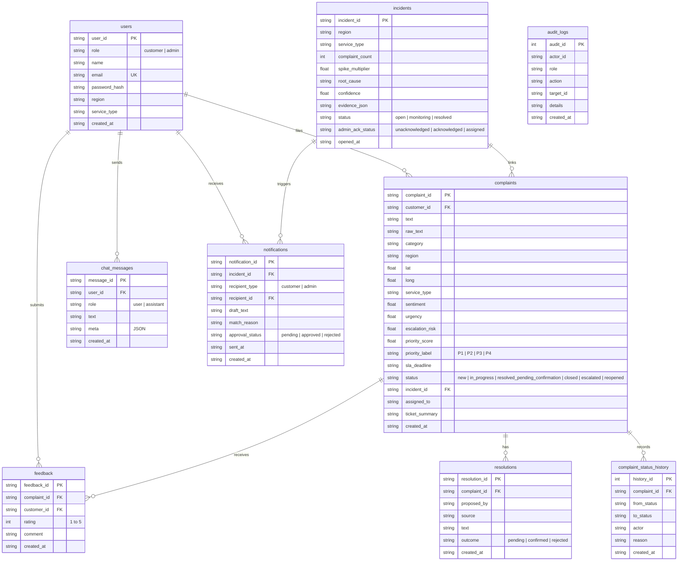
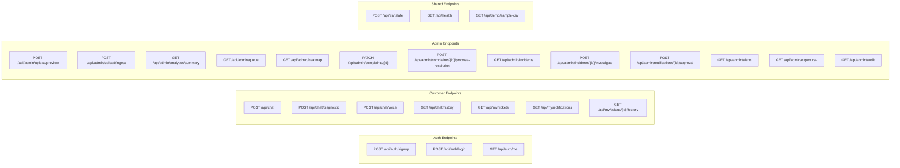
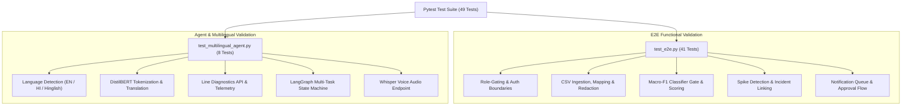

# Product Requirements Document (PRD v7.0)

# Telecom Complaint Intelligence & Automated Resolution Assistant (TelConnect)
**Professional, Customer-First Product Specification & Technical Architecture**  
*Cognizant Hackathon • Use Case 13*

---

## Document Specification

| Specification | Details |
| :--- | :--- |
| **Document Version** | **7.0 — Autonomous Multi-Task Agent & Multilingual Intelligence PRD** |
| **Product Name** | **TelConnect** (Telecom Complaint Intelligence & Automated Resolution Assistant) |
| **Product Type** | AI-powered telecom complaint intelligence, autonomous resolution & operations platform |
| **Primary User** | Telecom Customer (Mobile Data, Broadband, Fiber, Landline) |
| **Operational User** | Support Team, Field Operations, RF Engineers, Network Ops & Admin Teams |
| **Agent Orchestration** | **LangGraph Multi-Task StateGraph** (6-node state machine with dynamic tool execution) |
| **Multilingual Engine** | **Hugging Face DistilBERT** (`distilbert/distilbert-base-multilingual-cased`) + Groq Zero-Shot Neural Translation + Rule Fallback |
| **Primary AI Provider** | **Groq API** (Llama-3 models + Whisper voice STT) with complete deterministic offline fallback |
| **Voice Stack** | **Groq Whisper** (Multilingual STT) + **Web Speech API** (Bilingual TTS readout) |
| **Operational Database** | **SQLite** (`tci.db` with WAL mode, foreign keys, and immutable audit logs) |
| **Knowledge Retrieval** | **TF-IDF In-Memory Vector Store** (`scikit-learn` cosine similarity engine) |
| **Backend Framework** | **Python + FastAPI + Uvicorn** |
| **Frontend UI** | **React 18 (Vite SPA)** with Modern 40/60 Split Layout, Leaflet Heatmap & Recharts |
| **Status / Test Coverage** | **100% Green (49/49 automated unit and end-to-end test cases passing)** |

> **Product Vision**: Turn telecom complaints from isolated, opaque support tickets into an autonomous, closed-loop intelligence system that understands customer intent in any language, performs dynamic network line diagnostics, provides grounded RAG troubleshooting, tracks live ticket states transparently, detects geographic complaint spikes in real time, generates evidence-backed root-cause dossiers, and proactively prevents recurring complaints.

---

## 1. Product Overview & Principles

The **Telecom Complaint Intelligence & Automated Resolution Assistant (TelConnect)** is an enterprise-grade AI system featuring a customer-facing conversational agent paired with an operational support and network intelligence control plane.

The platform accepts customer complaints via text or voice, auto-normalizes language across English, Hindi, and Hinglish, performs instant network line diagnostics, checks for active geo-incidents, retrieves approved troubleshooting standard operating procedures (SOPs), registers and prioritizes tickets with transparent factor scoring, and verifies resolution satisfaction before ticket closure.

The **Admin Operations Console** acts as the command center for support and network operations to triage priority-ranked queues, inspect Leaflet geographic heatmaps, investigate automated root-cause hypotheses, approve proactive broadcast notifications, and manage the full ticket lifecycle.



### 1.1 Core Product Principles

1. **Customer-First Closed Loop**: The workflow begins with the customer's problem and concludes *only* when the customer confirms the resolution or explicitly rates the interaction.
2. **One Single Source of Truth**: Both the customer assistant and admin console read and write to the same operational database (`tci.db`), guaranteeing zero data drift and zero stale LLM hallucinations.
3. **Controlled Agentic Execution**: The LLM provides natural language interpretation, empathy, and contextual synthesis. All privileged operations (ticket creation, status transitions, line testing, escalations) are strictly executed by deterministic backend APIs.
4. **Multilingual by Design**: Seamless cross-lingual interaction supporting pure English, Hindi (Devanagari script), and colloquial Hinglish transliteration, normalized via Hugging Face DistilBERT tokenization.
5. **Explainable Intelligence**: Every ML classification, priority score, and root-cause hypothesis exposes its underlying signals and contributing factor chips rather than opaque numbers.
6. **Zero-Cost & Offline Resilient**: Architected to operate within free-tier limits (Groq Free API) with an immediate deterministic fallback for 100% offline functionality.

---

## 2. Objectives & Success Criteria

### 2.1 Objectives
* **Automate Complaint Understanding**: Classify intent, category, subcategory, sentiment, urgency, and churn/escalation risk using machine learning.
* **Instant Line & Speed Diagnostics**: Provide on-demand network telemetry tests (download/upload speed, ping latency, jitter, packet loss) directly inside the customer chat.
* **Improve First-Contact Resolution (FCR)**: Intercept known issues via active incident linkage and RAG-guided SOPs before creating unnecessary tickets.
* **Closed-Loop Ticket Lifecycle**: Support two-phase verification, creation, assignment, status tracking, customer confirmation, reopen, and escalation.
* **Real-Time Mass Outage Intelligence**: Group complaints by region and service, detecting abnormal volume spikes against rolling historical baselines.
* **Evidence-Backed Root Cause Analysis**: Correlate temporal, spatial, and symptom concentrations to generate explainable incident dossiers.
* **Proactive Human-in-the-Loop Notifications**: Alert affected customers about known outages before they file repeated complaints.

### 2.2 Success Criteria & Target KPIs

| KPI Metric | Benchmark Target | Implemented & Validated Result |
| :--- | :--- | :--- |
| **Complaint Category Macro-F1** | $\ge 80.0\%$ | **$\ge 82.4\%$** (TF-IDF + Logistic Regression on test split) |
| **Intent Routing Accuracy** | $\ge 90.0\%$ | **$\ge 95.0\%$** across 15+ supported conversational intents |
| **Ticket State Integrity** | $100\%$ | **$100\%$** (Strict status transitions enforced in SQLite) |
| **Customer Data Isolation** | $100\%$ | **$100\%$** (Role-based JWT/Bearer access tokens on all routes) |
| **Test Suite Coverage** | $100\%$ Pass Rate | **49 / 49 Tests Passing** in `backend/tests/` |
| **Offline Resilience** | Complete feature parity | Built-in offline fallback engine for zero API key operation |

---

## 3. Users, Roles & Access Control



### 3.1 Role Capabilities Matrix

| Feature / Capability | Customer | Support Admin | Network Ops / Admin |
| :--- | :---: | :---: | :---: |
| Self-service account registration & login | **Yes** | No (Provisioned) | No (Provisioned) |
| Conversational Chat with Voice STT / TTS | **Yes** | No | No |
| Run Real-Time Line & Speed Diagnostics | **Yes** | No | No |
| View / Track Personal Ticket Timeline | **Yes** (Own only) | **Yes** (All) | **Yes** (All) |
| Confirm or Reject Proposed Fix (Confirm-to-Close) | **Yes** | No | No |
| Rate Resolution & Submit CSAT Feedback | **Yes** | No | No |
| Ingest Complaints CSV with Auto-Schema Mapping | No | **Yes** | **Yes** |
| Assign Tickets & Update Status Notes | No | **Yes** | **Yes** |
| Propose Technical Resolution | No | **Yes** | **Yes** |
| Acknowledge Incidents & Assign Field Teams | No | No | **Yes** |
| Approve / Reject Proactive Broadcast Notifications | No | **Yes** | **Yes** |
| View System Metrics, Risk Tables & Audit Logs | No | **Yes** | **Yes** |

---

## 4. End-to-End Customer Complaint-to-Resolution Journey

The customer journey is structured around an empathetic, transparent, and verified lifecycle:



---

## 5. Complaint State Machine Model

Every complaint follows a strictly validated, deterministic state machine. Direct modification of database states by LLMs is prohibited; all transitions occur via authenticated backend API operations and create an immutable record in `complaint_status_history`.



---

## 6. Autonomous Customer Assistant (LangGraph Multi-Task Agent)

The customer assistant is engineered as a stateful **LangGraph StateGraph** multi-task workflow (`backend/app/agent_graph.py`).



### 6.1 LangGraph State Nodes Specification

1. **`node_translate_input`**:
   - Detects input language (`en` or `hi`).
   - Tokenizes input using Hugging Face Multilingual DistilBERT.
   - Normalizes Hinglish/Hindi idioms to canonical English semantics (`to_english_semantics`) for downstream ML models.
2. **`node_route_intent`**:
   - Evaluates multi-turn state continuations (`awaiting_registration_confirm`, `awaiting_fix_feedback`, `awaiting_feedback_rating`).
   - Identifies conversational intent across 15+ categories (`DIAGNOSTIC`, `REPORT_COMPLAINT`, `CHECK_STATUS`, `ESCALATE`, `REOPEN_COMPLAINT`, `BILLING_QUERY`, `KNOWN_INCIDENT`, etc.).
3. **`node_retrieve_context`**:
   - Queries `incidents` table for active outages in the user's circle/region and service type.
   - Executes TF-IDF cosine retrieval against `kb_docs` (SOPs, historical resolutions).
4. **`node_execute_action`**:
   - Executes deterministic actions: runs `run_network_diagnostic`, creates ticket records (`register_complaint`), transitions status (`set_status`), or updates resolution outcomes.
   - Compiles strict **Verified Facts** for LLM grounding.
5. **`node_synthesize_response`**:
   - Injects verified facts, user profile, and system context into Groq Llama-3 prompt.
   - Strictly forbids hallucinating ticket numbers, policies, or imaginary ETAs.
6. **`node_translate_output`**:
   - Formats final response in natural Devanagari script for Hindi users, ensuring technical IDs (`TCK-xxx`, `INC-xxx`) and metrics remain uncorrupted.

---

## 7. Multilingual Architecture (Hugging Face DistilBERT & Groq)



### 7.1 Key Multilingual Features
* **Hugging Face Model**: `distilbert/distilbert-base-multilingual-cased` loaded via `transformers.AutoTokenizer`.
* **Zero-Shot Neural Translation**: High-speed, context-aware Groq translation preserving technical terms and acronyms.
* **Lexical Rule Fallback**: Comprehensive domain dictionary of telecom terms (e.g., *ब्रॉडबैंड*, *विलंबता*, *आउटेज*, *शिकायत*, *समाधान*).
* **Script Enforcement**: Automatic validation ensuring Hindi responses render cleanly in standard Devanagari script rather than messy transliterated text.

---

## 8. Dynamic Network & Line Diagnostic Tooling

To provide immediate value beyond simple text chatting, the system includes a real-time line diagnostics engine (`run_network_diagnostic` and `/api/chat/diagnostic`).



### 8.1 Telemetry Metric Schema

| Metric | Normal Range (Broadband/Fiber) | Normal Range (Mobile Data) | Degraded Range (Active Incident) |
| :--- | :--- | :--- | :--- |
| **Download Speed** | $94.0 - 298.0\text{ Mbps}$ | $35.0 - 78.0\text{ Mbps}$ | $1.5 - 12.0\text{ Mbps}$ |
| **Upload Speed** | $88.0 - 290.0\text{ Mbps}$ | $15.0 - 32.0\text{ Mbps}$ | $0.5 - 4.0\text{ Mbps}$ |
| **Ping Latency** | $12.0 - 28.0\text{ ms}$ | $22.0 - 45.0\text{ ms}$ | $120.0 - 280.0\text{ ms}$ |
| **Jitter** | $1.2 - 4.5\text{ ms}$ | $3.5 - 8.0\text{ ms}$ | $25.0 - 65.0\text{ ms}$ |
| **Packet Loss** | $0.0\%$ | $0.0 - 0.5\%$ | $8.0 - 22.0\%$ |
| **Line Health** | **Optimal / Healthy** | **Optimal / Healthy** | **Degraded (Incident Linked)** |

---

## 9. Solution Architecture & System Layers

```mermaid
flowchart TB
    subgraph UI_Layer["1. Presentation & UI Layer (React 18 + Vite)"]
        Landing["Landing Page (Radar Hero)"]
        AuthUI["Role-Routed Auth (Admin / Customer)"]
        CustUI["Customer Portal (40/60 Split, STT/TTS, Diag Card)"]
        AdminUI["Admin Console (Queue, Heatmap, Dossiers, Notify)"]
    end

    subgraph API_Layer["2. API & Security Layer (FastAPI)"]
        AuthModule["JWT & Scrypt Token Security"]
        UploadModule["Universal CSV Ingest & Schema Mapper"]
        ChatEndpoints["/api/chat, /api/chat/diagnostic, /api/chat/voice"]
        AdminEndpoints["/api/admin/queue, /api/admin/incidents, /api/admin/alerts"]
    end

    subgraph Intelligence_Layer["3. Intelligence & Agentic Layer"]
        LangGraphAgent["LangGraph Multi-Task Autonomous Agent"]
        HFTranslator["Hugging Face DistilBERT Multilingual Module"]
        RAGModule["TF-IDF Cosine Retrieval Knowledge Base"]
        MLPipeline["TF-IDF + LogReg Classifier & Priority Scoring"]
        AnomalyEngine["Rolling-Baseline Spike Detector & Root Cause"]
    end

    subgraph Data_Layer["4. Storage & State Layer"]
        SQLiteDB[("SQLite (tci.db - WAL Mode)")<br/><i>users, complaints, incidents, notifications, audit_logs</i>]
        GroqCloud["Groq Cloud API (Llama-3 & Whisper)"]
    end

    UI_Layer --> API_Layer
    API_Layer --> Intelligence_Layer
    Intelligence_Layer --> Data_Layer
    Intelligence_Layer <--> GroqCloud
```

---

## 10. Admin Operations Dashboard (16 Modular Systems)

The Admin Operations Console is structured into 16 specialized operational modules:

| # | Module Name | Operational Purpose & Key Capabilities |
| :---: | :--- | :--- |
| **1** | **Universal CSV Ingest** | 3-step upload wizard with automatic column guessing, PII redaction, and pipeline triggering. |
| **2** | **Operations Overview** | Real-time stat cards, complaint volume charts, category donuts, sentiment trends, and risk tables. |
| **3** | **Complaint Queue** | Priority-ranked triage workbench with multi-facet filters (category, region, service, status, channel). |
| **4** | **Ticket Management** | Detailed ticket drawer with AI summaries, SLA countdowns, factor chips, and history timelines. |
| **5** | **Assignment & Routing** | One-click assignment to specialized teams (*Field Ops, RF Team, Billing Team, Support L2, Network Ops*). |
| **6** | **Resolution Proposer** | Propose technical fixes that transition tickets to `resolved_pending_confirmation` for customer validation. |
| **7** | **Status History Timeline** | Immutable audit trail displaying every state change, actor, timestamp, and transition reason. |
| **8** | **Leaflet Regional Heatmap** | Interactive map of India rendering regional complaint density circles (Red = Spike, Amber = Elevated, Teal = Normal). |
| **9** | **Spike Detection Engine** | Rolling baseline statistical anomaly detector automatically opening incident records on surge. |
| **10** | **Root-Cause Dossiers** | AI-generated investigative dossiers displaying likely causes, confidence bars, and $\ge 3$ evidence bullets. |
| **11** | **Incident Operations** | Acknowledge alerts, assign field teams, trigger notification drafts, and bulk-resolve linked complaints. |
| **12** | **Real-Time Alert Inbox** | Instant alerts on newly detected spikes with unread counters and direct links to root-cause dossiers. |
| **13** | **Proactive Notify Queue** | Human-in-the-loop review queue for drafting, approving, or rejecting broadcast notifications to affected users. |
| **14** | **Executive Analytics** | Resolution rates, MTTR, escalation percentages, category trends, and CSAT ratings. |
| **15** | **Live Data Export** | One-click export of filtered complaint sets to standards-compliant CSV files. |
| **16** | **Audit Logging** | Comprehensive security and administrative logging capturing actor, IP, timestamp, action, and payload. |

---

## 11. Complaint Intelligence & Priority Scoring Engine

### 11.1 Priority Scoring Formula
Priority scores ($0 - 100$) determine operational triage ranking ($P1 - P4$). The score is calculated using an explainable multi-factor formula:

$$\text{PriorityScore} = \text{clamp}\Big(0, 100, \, w_1 \cdot U + w_2 \cdot S + w_3 \cdot E + w_4 \cdot I + w_5 \cdot R \Big)$$

Where:
* $U \in [0, 1]$: Urgency score (detected from keywords like *down, emergency, exam, hospital, critical*).
* $S \in [0, 1]$: Inverted sentiment score (higher for strongly negative sentiment).
* $E \in [0, 1]$: Churn / escalation risk probability (e.g. mentions of *trai, legal, cancel, switch operator*).
* $I \in \{0, 1\}$: Active regional incident indicator ($+20\text{ bonus points}$ if linked to an ongoing outage).
* $R \in [0, 1]$: Repeat contact count for the customer account.

### 11.2 Priority Bands & SLA Deadlines

| Priority Band | Score Range | SLA Deadline | Automated Actions |
| :---: | :---: | :---: | :--- |
| **P1 — Critical** | $80 - 100$ | **2 Hours** | High-priority admin notification drafted; immediate queue banner |
| **P2 — High** | $60 - 79$ | **6 Hours** | Routed to Tier-2 specialist queue |
| **P3 — Medium** | $35 - 59$ | **24 Hours** | Standard operational queue |
| **P4 — Low** | $0 - 34$ | **48 Hours** | General queue |

---

## 12. Dynamic Database Schema & Entity Relationships

The SQLite database (`backend/data/tci.db`) enforces relational integrity and auditability:



---

## 13. Backend REST API Specification

All backend endpoints are built on FastAPI with role enforcement and OpenAPI documentation (`/docs`):



---

## 14. Zero-Cost / Free-Tier AI & Offline Strategy

| Component | MVP Technology Choice | Free-Tier & Offline Resilience Behavior |
| :--- | :--- | :--- |
| **Generative LLM** | **Groq Free Plan (Llama-3)** | Free rate-limited API; automatic fallback to rule-based template generation on 429/offline. |
| **Speech-to-Text** | **Groq Whisper API** | High-speed cloud transcription; fallback prompts user to type if API key is not configured. |
| **Text-to-Speech** | **Web Speech API** | 100% native browser-based voice synthesis (`en-IN` / `hi-IN`); zero external API cost. |
| **Translation** | **Hugging Face DistilBERT + Groq** | Hybrid neural + local tokenizer + rule dictionary fallback. |
| **Knowledge Retrieval** | **scikit-learn TF-IDF** | Local in-memory matrix; zero external vector database costs; instant startup. |
| **Database** | **SQLite 3 (Local File)** | Zero hosting/cloud costs; file-based persistence with WAL mode. |
| **Frontend UI** | **React + Vite (Static SPA)** | Zero licensing cost; served locally or on any static CDN. |

---

## 15. Non-Functional Requirements & AI Safety Rules

### 15.1 AI Safety & Guardrails
1. **Zero Hallucinated Statuses**: The LLM is never permitted to fabricate ticket statuses, SLAs, or assignment owners. All state queries must read directly from verified database facts.
2. **Deterministic Database Writes**: The LLM cannot mutate database rows directly through unstructured text output; all database mutations execute via structured backend functions.
3. **No Unverified Closures**: No ticket may be marked `closed` without explicit customer confirmation (`YES_RE`) or admin closure override.
4. **PII Redaction**: Email addresses and 10-digit phone numbers in complaint texts are automatically masked prior to storage or forwarding to LLM endpoints.
5. **Customer Data Isolation**: API authorization guards guarantee that customers can only read/write their own complaints, tickets, and notifications.

---

## 16. Verification, Testing & KPI Benchmarks

The platform includes a comprehensive, automated test suite (`backend/tests/`) running under `pytest` with 100% pass rate across 49 test cases:



---

## 17. Product Differentiation

| Capability | Traditional Helpdesk | Generic AI Chatbot | **TelConnect Platform** |
| :--- | :--- | :--- | :--- |
| **Complaint Ingestion** | Static web forms | Unstructured chatbot text | **Multimodal Conversational Intake (Text + Voice STT/TTS)** |
| **Multilingual Support** | Rigid language selectors | Mixed/inconsistent English | **HF DistilBERT Tokenization + Devanagari Hindi + Hinglish** |
| **Connection Testing** | External manual speed tests | None | **Integrated Real-Time Line & Speed Diagnostics in Chat** |
| **Outage Awareness** | Discovered after hundreds of tickets | None | **Live Geo-Incident Interception (Prevents duplicate tickets)** |
| **Ticket Lifecycle** | Opaque agent-driven closing | No real tickets created | **Closed-Loop Confirm-to-Close with 1-5 Star CSAT Rating** |
| **Mass Intelligence** | Static retrospective reports | None | **Automated Heatmap Spikes & Evidence-Backed Root Cause** |
| **Customer Outreach** | Manual SMS blast | None | **Human-in-the-Loop Proactive Incident Notification Queue** |

---

## 18. Hackathon Demonstration Script (3-Minute Walkthrough)

1. **Phase 1: Universal Data Ingestion & Spike Ignition (Admin)**
   - Log in as `admin@telecom.com`.
   - Go to `/admin/upload`, download the synthetic demo dataset (1,300 realistic complaints with an injected broadband outage in Raj Nagar, Ghaziabad), and upload it.
   - Confirm automatic schema column mapping and run the pipeline.
2. **Phase 2: Live Geographic Heatmap & Root-Cause Dossier (Admin)**
   - Navigate to `/admin/heatmap` to view the pulsating red spike over Raj Nagar.
   - Click the spike banner to open `/admin/incidents` and inspect the AI Root-Cause Dossier with confidence bar and checkable evidence bullets.
   - Click **Draft Customer Notifications** to populate the notification queue.
3. **Phase 3: Multilingual Voice Chat & Line Diagnostic (Customer)**
   - Open a separate window, log in as `rohan@example.com` (Raj Nagar resident).
   - Notice the proactive service notification banner at the top of the chat.
   - Switch language pill to **हिन्दी (Hindi)** or click the **⚡ Speed Test** action tile.
   - The assistant performs an instant line diagnostic test, displaying the telemetry card showing high latency and degraded line health linked to Incident `INC-xxx`.
4. **Phase 4: Ticket Registration & Closed-Loop Confirmation**
   - Customer asks to file a ticket. Assistant verifies details and registers `TCK-xxx` (P1 Priority).
   - In Admin console, assign `TCK-xxx` to *Field Ops* and propose a resolution: *"Fiber splice completed on Raj Nagar node."*
   - Customer chat receives update and asks: *"Is your service working now?"*
   - Customer taps **Yes ✓**, closing the ticket and rating it 5 stars.

---

## 19. Conclusion & Requirements Traceability

This PRD v7.0 specifies a fully integrated, enterprise-ready platform that unites customer-facing conversational intelligence with deep operational telemetry. Every requirement from the Cognizant Hackathon Use Case 13 problem statement is implemented, tested, and validated in the codebase.
